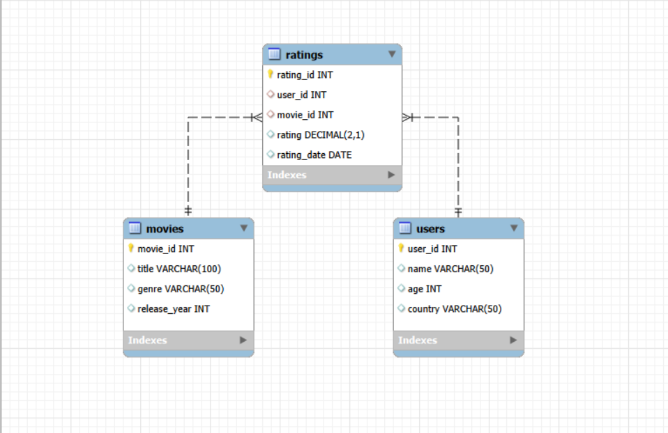

# 🎬 Movie Ratings Analysis (SQL Project)

## 📌 Project Overview
**Project Title :** Movie Rating Analysis  
**Level:** Easy  
**Database :** `movies_rating`  


This project focuses on analyzing movie ratings data using SQL to extract meaningful insights about user behavior, movie performance, and rating trends.

The goal of this project is to strengthen SQL concepts such as JOINs, aggregations, and data analysis while solving real-world business problems.

---
 


---

## 🎯 Objectives
- Analyze movie ratings and user behavior
- Identify top-rated movies and genres
- Understand rating trends over time
- Find the most active users

---

## 🗂️ Dataset Description

The dataset consists of 3 tables:

### 1. Movies
- movie_id (Primary Key)
- title
- genre
- release_year

### 2. Users
- user_id (Primary Key)
- name
- age
- country

### 3. Ratings
- rating_id (Primary Key)
- user_id (Foreign Key)
- movie_id (Foreign Key)
- rating
- rating_date

---

## 🧱 Database Schema

<br>

---

## 🛠️ Tools & Technologies
- SQL (MySQL)
- GitHub

---

## 📊 Key SQL Concepts Used
- INNER JOIN, LEFT JOIN
- GROUP BY & HAVING
- Aggregate Functions (AVG, COUNT, SUM)
- Subqueries
- ORDER BY, LIMIT

---

## 🔍 Business Questions Solved

### 🎬 Q1: What are the top-rated movies?

```sql
SELECT m.title, ROUND(AVG(r.rating),2) AS avg_rating
FROM movies m
JOIN ratings r ON m.movie_id = r.movie_id
GROUP BY m.title
ORDER BY avg_rating DESC
LIMIT 5;
```
--- 

### 🎭 Q2: Which genre has the highest average rating?

```sql
SELECT m.genre, ROUND(AVG(r.rating),2) AS avg_rating
FROM movies m
JOIN ratings r ON m.movie_id = r.movie_id
GROUP BY m.genre
ORDER BY avg_rating DESC
LIMIT 1;
```
---

### 👤 Q3: Who are the most active users?
```sql
SELECT u.name, COUNT(r.rating_id) AS total_ratings
FROM users u
JOIN ratings r ON u.user_id = r.user_id
GROUP BY u.name
ORDER BY total_ratings DESC
LIMIT 5;
```
---

### ⭐ Q4: What is the average rating per movie?
```sql
SELECT m.title, ROUND(AVG(r.rating),2) AS avg_rating
FROM movies m
JOIN ratings r ON m.movie_id = r.movie_id
GROUP BY m.title;
```

---

### 📈 Q5: How do ratings change over time?
```sql
SELECT DATE_FORMAT(r.rating_date, '%Y-%m') AS month,
       ROUND(AVG(r.rating),2) AS avg_rating
FROM ratings r
GROUP BY month
ORDER BY month;
```